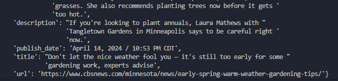

# News Scraper
## Python / Scrapy / Docker

## A simple Scrapy Script that captures news articles and saves them to a DB
### How it works

The function of this crawler is to scrape the local news page of CBS News Ex. 
   
www.cbsnews.com/{your-state}/local-news/

### Storage

Scrapy returns the data to a MYSQL Docker Container 

