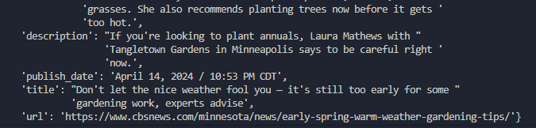

# News Scraper
## Python / Scrapy / Docker



## A simple Scrapy Script that captures news articles and saves them to a DB
### How it works


The function of this crawler is to scrape the local news page of CBS News Ex. 
<br> <br>
www.cbsnews.com/{your-state}/local-news/

When the docker comppose file is used, 2 containers start. One container will run a MYSQL Docker image , the other container is a Python Scrapy Image. 

After the compose file finishes, a MySQL Database starts running on Localhost.

Using Cron tasks we can then run the Python Image at any interval. (1 hour works well depending on location)

# How to use

1. Clone this repo navigate to the project directory
```
git clone https://github.com/TylerClark7/cbs-scraper.git
```

2. Build your Dockerfile for the Python/Scrapy container:

```
docker build <image-name-of your-choice> .
```
<strong>Note</strong>: Because I am using Cron Jobs I chose to not build the Python image in the Docker-Compose file

<b>IMPORTANT NOTE</b>: The name you choose for your Python image needs to match the name in the Docker-Compose file

```
docker build python-image .
```
```
#docker/docker-compose.yml


version: '3'

services:
  scraper:
    image: python-image <---- HERE

    container_name: scrapy-container-1
    depends_on:
      - scraper-sql
```

If you try to run this container before running docker compose up you will get errors.

4. After the image has been built you can change into the docker folder and run docker compose up in detatched mode

```
$ cd docker
$ docker compose -d        
```

Your MySQL Docker container should now be up and running. Initial data present on the web page will be added into the DB. The Python script will NOT run again unless you run the docker container `python-image` again. The python script will NOT run agian unless you run the docker container <i>python-image</i> again. 

The Mysql runs on the netwrok "docker_default". When you run the container make sure you include the netwrok tag --network

```
docker run --network=docker_default  python-image
```


